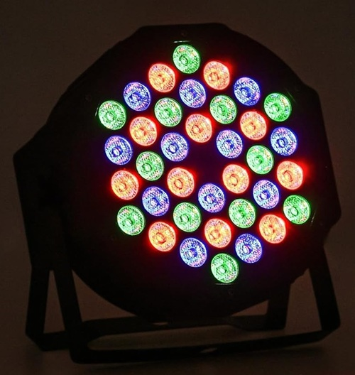
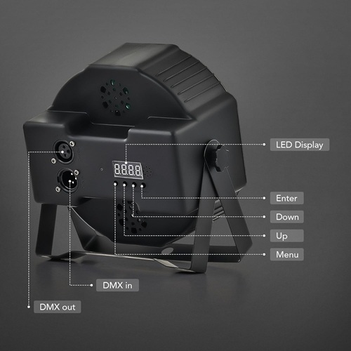

# Halloweenizer
## RaspberryPi Pico MIDI and DMX512 Controller

This project uses a Raspberry Pi Pico to control both MIDI and DMX512, creating a synchronized audiovisual experience for Halloween.

## 🎵 MIDI Integration  

The Pico sends MIDI output to a Roland S-330 digital sampler, which plays eerie sounds, special effects, and haunting organ chords. These sounds, amplified through speakers, set the perfect spooky atmosphere.

## 💡 DMX512 Lighting Control 
The DMX512 output drives two RGB projectors, programmed to create dramatic lighting effects, including simulated thunderstorms and eerie color shifts to enhance the ambiance.

## 🛠️ Build & Implementation 
### Schematic (Hand-drawn draft)
A wal-mounted 5 V power supply provides power to the VSYS input of the Raspberry Pi pico and the other components. A MC3487 chip converts the 3.3V GPIO output into a differential pair, which is then connected to a female XLR connector. Another GPIO pin controls two 2N2222 NPN transistors to drive the MIDI connector.

The project is currently assembled on a breadboard:

A permanent build is not planned at the moment, but the setup works well for its purpose.

## 🎃 Spooky Fun
This project was a blast to build, generating both frighteningly fun effects for kids and a satisfying challenge for the programmer!

